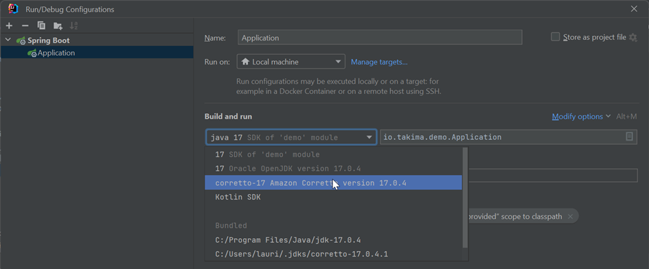

# Training Spring Boot

## I. Installation
**2 méthodes d'installation sont possibles : par téléchargements Internet ou par Clé USB**
### Windows
#### Par téléchargements Internet : 
- Docker : https://docs.docker.com/desktop/install/windows-install/
- Intellij : https://www.jetbrains.com/fr-fr/idea/download/#section=windows

#### Par clé : 
- Récupérer le fichier **Windows** et exécuter les .exe

### Mac 
Pour les puces M1 ou M2 choisir *Apple Chip* & *(Apple Silicone)*
Pour les puces Intel choisir *Intel Chip* & *(Intel)*

#### Par téléchargements Internet :
- Docker  : https://docs.docker.com/desktop/install/mac-install/
- Intellij : https://www.jetbrains.com/fr-fr/idea/download/#section=mac

#### Par clé : 
- Récupérer le fichier **Mac** correspondant à la bonne puce et exécuter les .exe

### Linux 
#### Commandes pour les installations : 
- Docker :  
  - `curl -fsSL https://get.docker.com -o get-docker.sh`  
  - `sudo sh get-docker.sh`
  - `sudo usermod -aG docker $USER` 
- Intellij :  
  - `sudo snap install intellij-idea-ultimate --classic`

#### Par clé : 
- Récupérer les lignes de commandes dans le fichier du dossier Linux

## II. SetUp Intellij 
### 1. Création compte 
Intellij est un IDE super complet et est devenu un indispensable pour le dévelopement de projet Java.   

Avec ses recherches de fichiers optimisées, auto-complétions et raccourcis à gogo, Intellij améliore grandement l'expérience de développement. 
Le Graal étant que maven y est de base intégré et que tu puisses
télécharger n'importe quelle version de Java directement depuis ton IDE (non ce n'est pas un rêve !) 

Cerise sur le gateaux grâce à ton compte EPF, tu peux gratuitement obtenir une licence de la version payante (ultimate).
Elle est essentielle au bon déroulement du TP car avec cette derniere tu pourras notamment visualiser ta base de donnée et intéragire avec elle directement depuis IntelliJ.  
Pour te créer un compte, suis ce lien et effectue les actions détaillées ci-dessous : https://www.jetbrains.com/fr-fr/idea/

### 2. Licence Intellij
Pour récupérer une licence gratuite utilise ce lien : https://jetbrains.com/shop/eform/students

### 3. Lancer Intellij 
Une fois ta licence récupérer, lance l'IDE et relie ton compte

### 4. Clonage du projet 
Pour récupérer le repository GitHub du TP lance `git clone https://github.com/resourcepool/training-spring-boot.git`

Tu y trouveras toutes les ressources nécessaires à la suite du TP.

Dans Intellij, effectue ensuite les actions suivantes :

### 5. Téléchargement de Java 17
Depuis Intellij, tu peux directement télécharger Java 17 :  

### 6. Ouvrir un terminal dans Intellij 

 
Tu peux également changer de Shell (Surtout utile pour les Windows) 

 

Sélectionne *Git Bash*

## III. SetUp de la BDD via Docker
### 1. Docker
Lance le Docker Desktop en cliquant sur l'icône, tu dois obtenir l'écran suivant :

Ferme et ré-ouvre ton application IntelliJ pour que les changements effectués par l'installation de docker soit pris en compte. 
Pour s'assurer que ton install Docker a bien fonctionné lance la commande suivante dans ton terminal :   
`docker run hello-world`  
Tu dois obtenir ce résultat :  

Tu peux alors lancer la base de données MariaDB qui sera utilisé tout au long du TP : 
`docker run --name mariadb --rm -e MYSQL_ROOT_PASSWORD=toor -e MYSQL_DATABASE=defaultdb -p 3306:3306 mariadb`

### 2. Afficher la BDD dans Intellij 
Effectue les étapes suivantes : 

Installe les drivers si besoin : 

Saisie les infos (1-3), puis test la connexion à la bdd (4)

  
Si c'est valide, clique sur *OK* (5)

### 3. Initialisation de la BDD
C'est cool d'avoir une BDD qui fonctionne mais c'est encore plus cool quand on peut lui insérer des données en 2 clics :

Clic droit + run : 

Tadaaaam (j'avoue un peu plus que 2 clics)

## IV. Run du projet (c'est bientôt fini promis !)
**Deux** façons de faire : 

**OU**

Ca ouvre : 

Sélectionne le Java 17 préalablement téléchargé et ajoute l'option `-Xms256m -Xmx256m` (c'est pour éviter que Intellij mange toute ta RAM) 

Enfin : 

Alors ça marche ?

