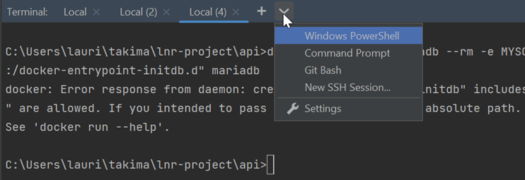
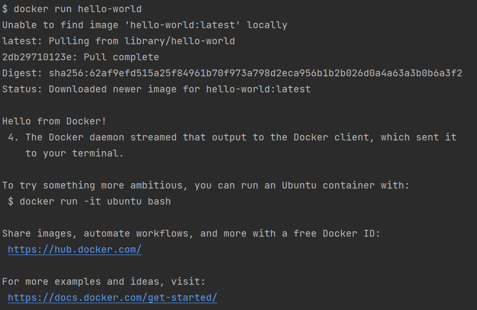

# Training Spring Boot

## I. Installation
**2 méthodes d'installation sont possibles : par téléchargements Internet ou par Clé USB**
### Windows
Liens des téléchargements Internet : 
- Docker : https://docs.docker.com/desktop/install/windows-install/
- Intellij : https://www.jetbrains.com/fr-fr/idea/download/#section=windows

Par clé : 
- Récupérer le fichier **Windows** et exécuter les .exe

### Mac 
Pour les puces M1 ou M2 choisir *Apple Chip* & *(Apple Silicone)*
Pour les puces Intel choisir *Intel Chip* & *(Intel)*

Liens pour les téléchargements Internet : 
- Docker  : https://docs.docker.com/desktop/install/mac-install/
- Intellij : https://www.jetbrains.com/fr-fr/idea/download/#section=mac

Par clé : 
- Récupérer le fichier **Mac** correspondant à la bonne puce et exécuter les .exe

### Linux 
Commandes pour les installations : 
- Docker :  
  - `curl -fsSL https://get.docker.com -o get-docker.sh`  
  - `sudo sh get-docker.sh`
  - `sudo usermod -aG docker $USER` 
- Intellij :  
  - `sudo snap install intellij-idea-ultimate --classic`

Par clé : 
- Récupérer les lignes de commandes dans le fichier du dossier Linux

## II. SetUp Intellij 
### 1. Création compte 
Intellij est un IDE super complet : il te permet notamment de construire des projets Java complet sans te soucier des installations et de visualiser ta base de données.
Grâce à ton compte EPF, tu peux obtenir une licence gratuite de la version ultimate.  
Pour te créer un compte, suis ce lien et effectue les actions détaillées ci-dessous : https://www.jetbrains.com/fr-fr/idea/

### 2. Licence Intellij
Pour récupérer une licence gratuite utilise ce lien : https://jetbrains.com/shop/eform/students

### 3. Lancer Intellij 
Une fois ta licence récupérer, lance l'IDE et relie ton compte

### 4. Clonage du projet 
Pour récupérer le projet du répo GitHub lance `git clone https://github.com/resourcepool/training-spring-boot.git`

Dans Intellij, effectue ensuite les actions suivantes : 

### 5. Téléchargement de Java 17
Depuis Intellij, tu peux directement télécharger Java 17 :

### 6. Ouvrir un terminal dans Intellij 

Tu peux également changer de Shell (Surtout utile pour les Windows)

Sélectionner *Git Bash*

## III. SetUp de la BDD via Docker
### 1. Docker
Lance le Docker Desktop en cliquant sur l'icône, tu dois obtenir l'écran suivant :

Si tu as utilisé Intellij pour taper les lignes de commandes précédentes, ferme et ré-ouvre l'IDE.
Pour s'assurer que ton install Docker a bien fonctionné lance : 
`docker run hello-world`  
Tu dois obtenir ce résultat : 

Tu peux alors lancer la base de données MariaDb  
`docker run --name mariadb --rm -e MYSQL_ROOT_PASSWORD=toor -e MYSQL_DATABASE=defaultdb -p 3306:3306 mariadb`

### 2. Afficher la BDD dans Intellij 
Effectue les étapes suivantes : 

Installe les drivers si besoin : 

Saisie les infos (1-3), test la connexion (4) 

Si c'est valide, clique sur *OK* (5)

### 3. Initialisation de la BDD
C'est cool d'avoir une BDD qui fonctionne mais c'est encore plus cool quand on peut lui insérer des données en 2 clics :

Clic droit + run : 

Tadaaaam (j'avoue un peu plus que 2 clics)

2. Suivre la procédure d'installation des environnements INSTALL_XXX.md

3. Ouvrir le projet `webapp-hello-world` dans votre IDE (IntelliJ IDEA recommandé)
